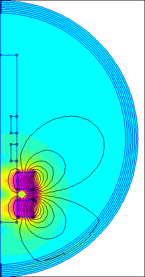
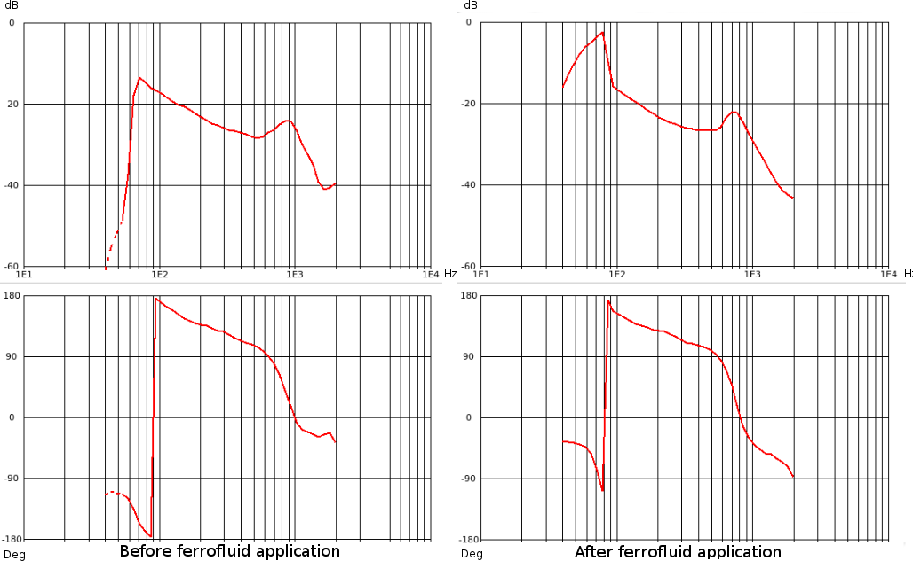

# Energy Harvester Design for Intelligent Tyre Systems
##TLDR
Modern tyres can have sensor systems which require energy. Currently these 
systems are powered by batteries, which limit the power available and lifetime
of the systems. This study presents an energy harvester system to power such
sensor systems. Piezoelectric and electromagnetic harvester designs are presented
and the piezoelectric harvester design was selected for use in the tyre. Electrical
energy was harvested from tyre rotation and deformation, harvested power was
rectified and stored into a supercapacitor at a voltage level usable by modern
microcontrollers. Tens of milliwatts of electrical power was obtained from both
harvesters in a vibration exciter test setup, and the piezoelectric harvester produced
13 microwatts of electrical power in a chassis dynamometer test rig. Further testing
indicates 50 microwatts of power is obtainable at a higher speed of the tyre. The
power obtained from harvester exceeds sleep mode power requirement of sensor
system, and the sensor system could be theoretically operated intermittently with
the power available from harvester. Continuous operation of a sensor system is not
feasible with the presented harvester.

##The Good Parts
Some of the energy harvesting hardware under folder "hardware" has sparked interest. Printed circuit boards are designed in open source software KiCAD which allows anyone to explore and modify designs without investing in expensive software licenses. 

PCB designs are licensed under CERN OHL 1.2, please see [LICENSE.md](/LICENSE.md) for details.

My personal favourite piece of work during the thesis was making animations of magnetic fields using a magnetics FEA software *FEMM*. Lua scripts were used to step parameters of the simulation and exporting images of fields strenghts. Finally *convert* was used to create animations from the images.
for example `convert -delay 12 -loop 0 magnet*.bmp animated.gif` .

Maybe the most interesting detail in the thesis is application of ferrofluid in electromagnetic harvester design. Ferrofluid significantly lowers the friction rotor magnet sees inside the shaft of generator, bringing a lot sharper peak in frequency output as seen in figure below.

.

